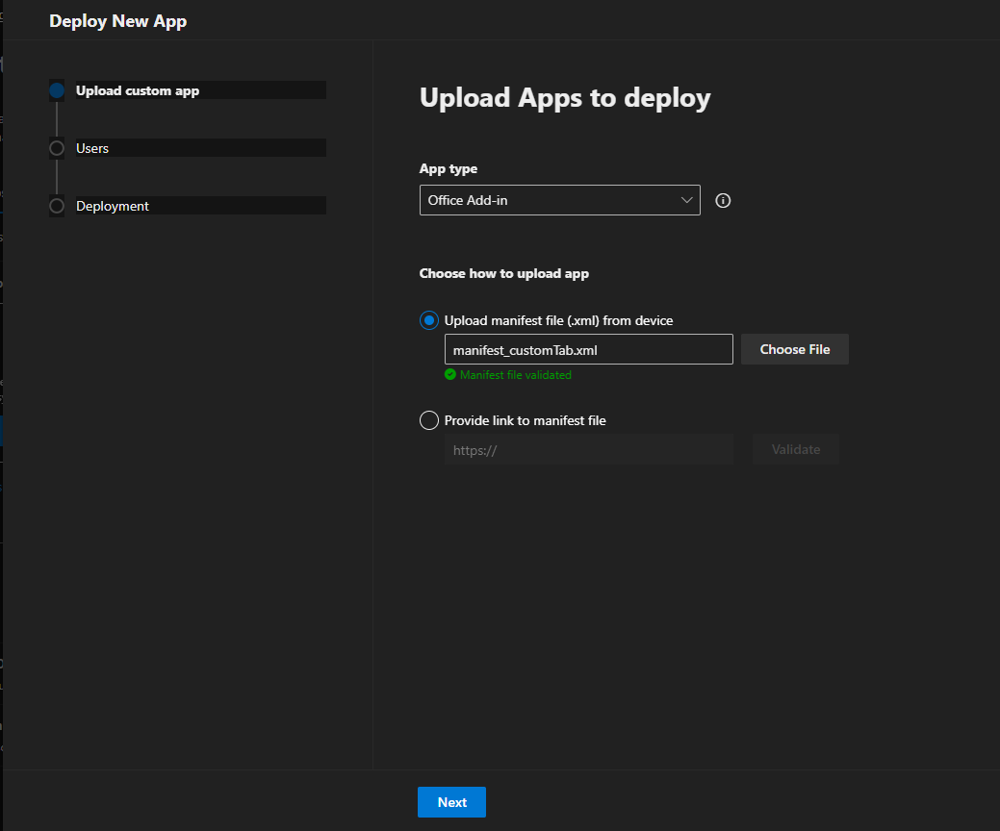
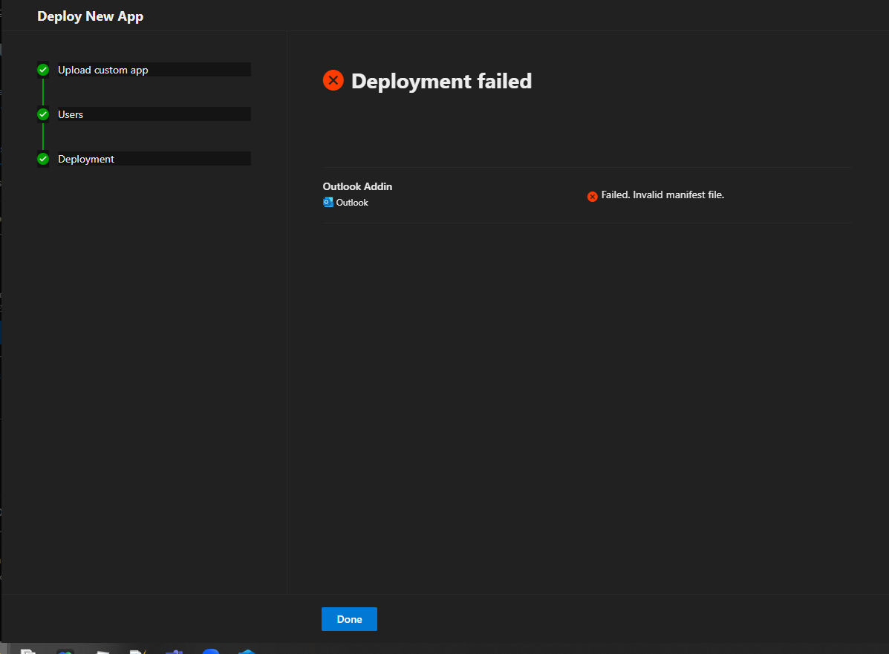

# OutlookAddin_CustomTab

### Description

CustomTab manifest cannot be installed via admin center.

### Steps to reproduce

1. Go to Microsoft 365 admin center.
2. Deploy manifest_customTab.xml

Expected result:
Manifest deployed successfully.

Actual result:
Deploy failed.

### More info: 

How to deploy:
https://learn.microsoft.com/en-us/microsoft-365/admin/manage/office-addins?view=o365-worldwide

office-addin-manifest says that manifest_customTab.xml is valid

If deploy manifest.xml everything works fine.

### Screenshots

